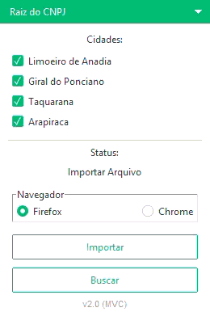

# 🤖 Buscador de Empresas

Aplicativo desktop com interface gráfica para automação de busca de dados de empresas via raiz de CNPJ ou CACEAL.

---

## 🧠 Funcionalidades

* ✔️ Busca automatizada nos navegadores Chrome e Firefox
* ✔️ Suporte a busca em lote importando arquivo Excel (.xlsx)
* ✔️ Busca segmentada pelas seguintes cidades disponíveis:
  * 🏙️ Limoeiro de Anadia
  * 🏙️ Taquarana
  * 🏙️ Arapiraca
  * 🏙️ Giral do Ponciano
* ✔️ Exportação dos resultados detalhados (Responsável, Empresa, Local, Email) para Excel
* ✔️ Interface amigável 

---

## 🛠️ Tecnologias

* Python
* Tkinter & ttkbootstrap (Interface Gráfica)
* Selenium & webdriver-manager (Automação Web)
* Pandas, openpyxl & XlsxWriter (Processamento de Dados)

---

## 📂 Estrutura do Projeto

* `controllers/`: Lógica de integração e fluxo do aplicativo
* `models/`: Regras de negócio, automação web e manuseio de dados Excel
* `views/`: Interface gráfica construída com Tkinter
* `public/`: Arquivos estáticos e mídias
* `main.py`: Ponto de entrada do aplicativo
* `requirements.txt`: Dependências do projeto

---

## ⚙️ Como usar

```bash
# Clonar repositório
git clone https://github.com/JockaMt/EmpresasEmDefices.git

# Entrar no diretório
cd EmpresasEmDefices

# Instalar dependências
pip install -r requirements.txt

# Rodar o aplicativo
python main.py
```

---

## 📸 Demonstração



---

## 🎯 Objetivo

Projeto desenvolvido para automatizar a busca e extração de informações de empresas em plataformas governamentais utilizando automação de navegadores.

---

## 💡 Melhorias futuras

* [x] Refatoração para arquitetura MVC ✅
* [ ] Suporte a execução em segundo plano (Headless mode)
* [ ] Adicionar mais cidades para pesquisa
* [ ] Barra de progresso para acompanhamento em tempo real

---

## 📄 Licença

MIT
